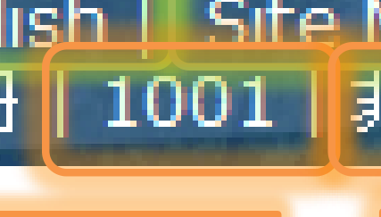
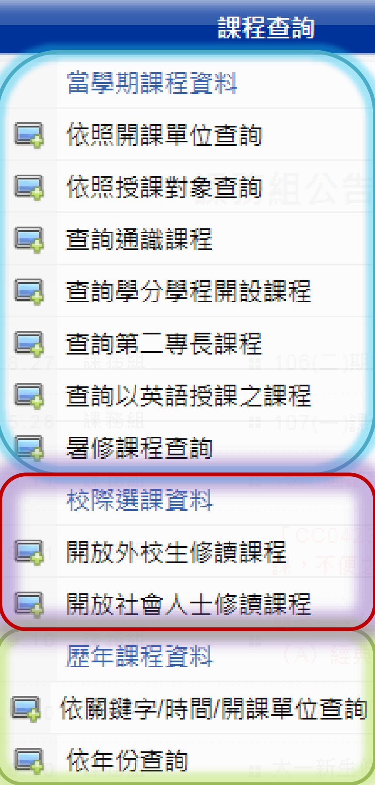

![This image appears to be a title slide or informational graphic.  It features a blue and silver globe on the left. The main text, in large dark blue Chinese characters, reads "中央大學" \(National Central University\). Below this, it says "選課系統使用手冊" \(Course Selection System User Manual\), and in parentheses, "\(外校生/社會人士\)" \(External Students / General Public\).  A blue underlined hyperlink, `https://cis.ncu.edu.tw/Course/`, is displayed prominently below the text. The background is white with a faint grid pattern of small squares.](images/CCOP_1.pdf-0-0.png)


# `如何使用系統如何使用系統(1)(1)`

- • 於中大首頁於中大首頁-->>學生學生-->>快速連結快速連結-->>選課系統，選課系統，即可看即可看

到新版的選課系統到新版的選課系統


# `如何使用系統如何使用系統(2)(2)`


![This image shows the black, pixelated Chinese/Japanese characters "課程查詢" \(kèchéng cháxún\), meaning "Course Inquiry" or "Curriculum Inquiry." The text is centered on a light blue rectangular field, which is itself framed by a thicker, reddish-orange border with rounded corners that has a slight glowing effect. Behind this, and slightly outside the red border, are translucent, darker horizontal bands. A thin blue line extends downwards from the center-bottom of the red border. The overall appearance is that of a digital button or label.](images/CCOP_1.pdf-2-2.png)


「課程查詢」不論有無登入系統皆可操作「課程查詢」不論有無登入系統皆可操作

- •

![This is a circular logo for the "Computer Center", likely of National Central University \(NCU\) in Taiwan, as indicated by the URL "www.cc.ncu.edu.tw" and Chinese characters.  The logo features: \*   A dark blue outer ring with "Computer Center" in white text at the top and the website address "www.cc.ncu.edu.tw" at the bottom. \*   The center contains an inverted yellow triangle with a blue border. \*   Inside the triangle are red Chinese characters \(likely "國立中央大學" - National Central University\) at the top, a black silhouette of a traditional East Asian-style gate or building, and stylized blue waves at the bottom, suggesting water.](images/CCOP_1.pdf-3-0.png)
# `如何使用系統如何使用系統(3)(3)`

頁面右上角可以找到目前系統的狀態。頁面右上角可以找到目前系統的狀態。

- •


![This image displays two lines of Chinese text in black, set against a white background. The text is enclosed within a light green rectangular border, and there's a subtle, slightly darker green, soft-edged background or glow around the entire box.  The text reads: 如果同學用的是公用電腦, 請注意這邊的身份喔  This translates to: "If classmates/students are using a public computer, please pay attention to the identity/login credentials here." It's a reminder, likely about logging out or being careful with personal information on a shared machine.](images/CCOP_1.pdf-3-1.png)


![This is a close-up image of a digital interface, likely a website header or application navigation bar. It features pixelated white text, primarily in Chinese with some English, against a dark blue, blurry background.  Key elements visible include: \*   A numerical ID on the left: "995202080" \*   Chinese text options like "問題回報" \(Problem Report\), "登出 \(logout\)", "操作手冊" \(Operation Manual\), and "關於本系統" \(About this system\). \*   English options: "English", "Site Map". \*   Numbers like "1001" and an online user count "線上人數: 17" \(Online users: 17\).  Several text sections are enclosed in glowing green or orange rounded rectangular borders.](images/CCOP_1.pdf-3-9.png)





![This is a circular logo, likely for an academic institution's computer center.  It features a dark blue outer band with "Computer Center" in white text arched along the top, and "www.cc.ncu.edu.tw" arched along the bottom.  The white center contains an inverted triangle with a blue border and yellow fill. Inside the triangle, from top to bottom, are: \*   Red Chinese characters \(國立中央大學, National Central University\). \*   A black silhouette of a traditional East Asian-style gate or pavilion. \*   Stylized blue wavy lines representing water.  It appears to be the logo for the Computer Center of National Central University \(NCU\) in Taiwan.](images/CCOP_1.pdf-4-0.png)
# `登入系統登入系統(1)(1)`

![This is a screenshot of a Chinese-language login page, likely for an educational institution's "New Course Registration System" \(新選課登記系統\).  A red box highlights the "Log in to System" \(登入系統\) button in the top right. A red arrow points from the general login area towards another red-boxed message at the bottom: "External students/members of the public, please use NetID to log in" \(外校生/社會人士請使用 NetID 登入\).  The main login form itself requests a "Portal account" \(Portal 帳號\) and password \(密碼\).](images/CCOP_1.pdf-4-1.png)

![This image displays a login interface, likely for an educational institution's online system, presented in Chinese. Key elements visible are: 1.  Tabs at the top: "課程查詢" \(Course Search\) and "登入系統" \(Login System\), with the latter highlighted by a red box and arrow. 2.  A login form area where the text indicates "帳號為 Portal 帳號" \(Account is Portal Account\), followed by two input fields \(presumably for username and password\) and a "登入" \(Login\) button. 3.  A message at the bottom, highlighted by a red box and arrow, stating: "外校生/社會人士請使用 NetID 登入" \(External students/social personnel please use NetID to log in\).  The red arrows and boxes appear to be annotations drawing attention to the "Login System" tab and the instruction for NetID login.](images/CCOP_1.pdf-4-2.png)
### 點選「外點選「外校生校生 社會人士請使用社會人士請使用 登入登入」 // NetIDNetID

# `登入系統登入系統(2)(2)`


![This image displays a login interface, primarily in Chinese, for a "NetID" account. It features: 1.  An instruction at the top: "若您沒有 NetID 帳號，請至此處申請。" \(If you don't have a NetID account, please apply here.\) The words "此處" \(here\) are underlined, indicating a hyperlink. 2.  An input field labeled "帳號" \(Account\). 3.  A button labeled "登入" \(Login\). 4.  A red arrow points from the instruction to a red-outlined box on the right, which re-emphasizes a similar message: "若您沒有 NetID 帳號，可按此處申請" \(If you don't have a NetID account, you can click here to apply\).  Essentially, it's a login prompt with a clear instruction and link for users who need to create an account first.](images/CCOP_1.pdf-5-2.png)


首先，要登入系統請使用首先，要登入系統請使用在在電算中心網頁電算中心網頁

- •
申請的申請的
Net IDNet ID
請輸入請輸入 帳號帳號

- • Net IDNet ID (E(E--mail)mail)

![This is a circular logo, primarily in blue and white. It features an outer dark blue ring with a double white border, containing the white text "Computer Center" arched at the top and "www.cc.ncu.edu.tw" arched at the bottom. The central white area contains an inverted triangle with a blue and yellow border. Inside the triangle, from top to bottom, are red Chinese characters \(國立中央大學 - National Central University\) on a yellow background, a black silhouette of a traditional East Asian gate or pavilion, and stylized blue and white waves representing water.](images/CCOP_1.pdf-6-0.png)
# **申請申請** **Net ID(1Net ID(1))**

**1. 1. 閱讀閱讀「個人資料蒐集、處理及利用告知事項」後，點選「同意」「個人資料蒐集、處理及利用告知事項」後，點選「同意」**

![This is a screenshot of a webpage or document in Chinese. The main heading indicates it's from the "國立中央大學 教務處" \(National Central University, Office of Academic Affairs\). The title below this is "個人資料蒐集、處理及利用告知事項" \(Personal Data Collection, Processing, and Use Notification\).  The subsequent paragraph explains that this notice, regarding how personal data collected by the website is handled, is in accordance with the "Personal Data Protection Act" \(個人資料保護法\) and asks users to read and consent to its terms. A scrollbar on the right indicates more content below the visible area, and a light gray circle is on the left within the content block.](images/CCOP_1.pdf-6-1.png)

**2. 2. 請請依序填入：依序填入：帳號帳號((電子信箱電子信箱))、密碼、密碼、密碼、密碼((確認確認))、勾選我不是機器人、勾選我不是機器人，點選，點選**
**【註冊】【註冊】**


![This is a screenshot of a webpage for "中央大學入口網站" \(Central University Portal Website\), likely a registration page.  The header is a blue bar with the website title in Chinese and a hamburger menu icon on the right. Below the header, there are three navigation tabs: "註冊 NetID" \(Register NetID\), "驗證碼" \(Verification Code\), and "忘記 NetID 的密碼" \(Forgot NetID Password\). The "Register NetID" tab is currently active.  The main content area is a light gray form titled "註冊 NetID" \(Register NetID\). It contains the following fields: \*   \*\*電子郵件 \(Email\):\*\* An input field labeled "Your email". \*   \*\*密碼 \(Password\):\*\* An empty input field. \*   \*\*密碼 \(確認\) \(Password \(Confirm\)\):\*\* Another empty input field. \*   \*\*檢查 \(Check\):\*\* A reCAPTCHA "我不是機器人" \(I'm not a robot\) checkbox.  At the bottom of the form, there is a blue button labeled "註冊" \(Register\).](images/CCOP_1.pdf-6-2.png)
![This is a circular logo with a dark blue outer band. The band contains white text: "Computer Center" arched at the top, and "www.cc.ncu.edu.tw" arched at the bottom. The center is white, featuring an inverted blue-bordered triangle. Inside the triangle, the top portion is yellow with red Chinese characters. Below this is a black silhouette of a traditional East Asian gatehouse or pavilion above stylized blue and white waves. The URL suggests this is the logo for the Computer Center of National Central University \(NCU\) in Taiwan.](images/CCOP_1.pdf-7-0.png)

**Net ID**
至電子信箱收信，並

# **申請申請** **Net ID(2)Net ID(2)**

**3. 3. 請請** **至電子信箱收信** **至電子信箱收信，，** **點擊信件內文連結** **點擊信件內文連結以確認申請，以確認申請，** **Net ID** **Net ID帳號啟動成功帳號啟動成功**
(1)(1)至電子信箱收信， 並點擊啟動帳號連結 至電子信箱收信，並


**Net ID**
至電子信箱收信，並


**Net ID**
至電子信箱收信，並


![This is a screenshot of an email written in Traditional Chinese. It appears to be an automated email from the "中央大學 Portal 服務" \(National Central University Portal Service\) regarding an "帳號申請認證碼" \(account application verification code\).  The email informs the recipient that this is an account activation message and provides a long URL \(highlighted by a red box\) that needs to be clicked to activate an account. It also states that the link will expire in 1 hour and advises the recipient to disregard the email if they did not initiate an account application. The email is signed off by the "中央大學 電算中心" \(National Central University Computer Center\).](images/CCOP_1.pdf-7-3.png)

**Net ID**
至電子信箱收信，並


(2)

# **申請申請** **Net ID(3)Net ID(3)**

(2 )勾選 (2) 勾選我不是機器人，點選【註冊】我不是機器人，點選【註冊】

![This image shows a web form in Chinese for email confirmation and registration.  The form has the following elements: 1.  A title: "電子郵件確認, 進行註冊" \(Email Confirmation, Proceed to Register\). 2.  An email input field labeled "電子郵件" \(Email\), with the domain "@g.ncu.edu.tw" pre-filled. 3.  A reCAPTCHA verification section labeled "檢查" \(Check/Verify\), with a green checkmark and the text "我不是機器人" \(I am not a robot\) displayed, indicating the CAPTCHA has been successfully completed. 4.  A blue button at the bottom left labeled "註冊" \(Register\).  The form is likely used to register for a service using an email address associated with the g.ncu.edu.tw domain.](images/CCOP_1.pdf-8-1.png)

(2)


(3)Net ID(3)Net ID已啟動已啟動


(2)

![This is a circular seal or logo. It features a wide, dark blue outer band with "Computer Center" in white, sans-serif text curving along the top, and the website address "www.cc.ncu.edu.tw" along the bottom.  The center contains an inverted yellow triangle with a blue border. Inside the triangle are: \*   At the top: Red Chinese characters \(國立中央大學, National Central University\). \*   In the middle: A black silhouette of a traditional gabled structure, possibly a gate or pavilion. \*   At the bottom: Stylized blue and white wavy lines representing water.  The ".edu.tw" domain indicates it's for the computer center of an educational institution in Taiwan.](images/CCOP_1.pdf-9-0.png)

**信箱**

# `登入系統登入系統(1)(1)`

**至選課至選課系統，使用系統，使用** **登入，登入，輸入帳號輸入帳號** **電子電子**
**1.1.** **Net IDNet ID** **((**
**信箱** **信箱** **，點選【登入】，點選【登入】**
**))**


**信箱**


**信箱**


# `登入系統登入系統(2)(2)`

**登入登入頁面導引至入口網站頁面導引至入口網站**
**2.2.**
(1)(1)入口網站帶入入口網站帶入Net IDNet ID帳號帳號，， (2)(2)點選【堅決前往】點選【堅決前往】
請請 輸入密碼 輸入密碼，點選【登入，點選【登入PortalPortal】】


![This is a screenshot of a webpage from the \*\*National Central University \(NCU\) portal\*\*, likely in Taiwan, displayed in Chinese.  It's a \*\*security warning page\*\* that appears before redirecting the user to another site. The page indicates the system will guide the user to a service website, but labels this target as an "Unknown \(potentially dangerous\) website" in Chinese and a "Potentially malicious website" in English.  It further cautions that the destination site is not officially provided by NCU, the system information could be forged, and lists the target URL as `http://cis.ncu.edu.tw/Course/main/netid`.  A red button labeled "堅決前往" \(Proceed Resolutely / Continue Anyway\) allows the user to proceed despite the warning.](images/CCOP_1.pdf-10-1.png)

![This image shows a login page for the "中央大學入口網站" \(National Central University Portal\).  It features: \*   A header with the university logo and the title "中央大學入口網站". \*   An input field labeled "帳號" \(Account/Username\), where the user enters their username before "@g.ncu.edu.tw". \*   An input field labeled "密碼" \(Password\). \*   A checkbox labeled "記住我?" \(Remember me?\). \*   A link "「 使用其它帳號登入 」如果想用其它帳號登入。" \(Click "Use other account to log in" if you want to use other accounts to log in.\). \*   A blue button labeled "登入 Portal" \(Log in Portal\).](images/CCOP_1.pdf-10-2.png)
![This is a circular logo with a dark blue outer band. The top of this band features the white text "Computer Center", and the bottom has "www.cc.ncu.edu.tw". Inside the circle, there's an inverted triangle with a yellow border and a white background. Within the triangle, there are red Chinese characters at the top, a black silhouette of a traditional East Asian-style building \(possibly a pagoda or gate\) in the middle, and blue stylized waves at the bottom. The overall impression is that of an institutional or university department logo.](images/CCOP_1.pdf-11-0.png)
# `登入系統登入系統(3)(3)`

**請請選擇您要使用的功能選擇您要使用的功能：：**
**3.3.**
若您是學生本人，請選擇校際若您是學生本人，請選擇校際選課。選課。

- •
若為學生家屬，請若為學生家屬，請選擇學生家長。選擇學生家長。

- •


# `登入系統登入系統(4)(4)`


- • 第一次申請，請第一次申請，請

填妥個人資料填妥個人資料，，
點選點選【【確定送出確定送出
】】後即可以後即可以開始開始
選課。選課。


![This is an online registration form, likely for an educational institution, presented in Traditional Chinese.  It collects personal details such as ID number, name \(pre-filled with "王大明" - Wang Da-ming\), gender \(male selected\), date of birth, email \(pre-filled with "test@gmail.com"\), address, and education level.  A separate section is dedicated to "School Information" \(就讀學校資訊\), asking for the attending school \(pre-filled with "國立中興大學" - National Chung Hsing University\), department \(pre-filled with "中文系" - Chinese Department\), and student ID.  Asterisks \(\*\) indicate required fields. At the bottom, there's a privacy statement and a "確定送出" \(Confirm and Send\) button.](images/CCOP_1.pdf-12-1.png)
```
功能選單功能選單

```

![This image shows a circular logo or seal. It features a dark blue outer band with a white inner border. White text arches around the top, reading "Computer Center," and along the bottom, reading "www.cc.ncu.edu.tw."  The center of the logo is white and contains an inverted yellow triangle with a blue border. Inside the triangle, there are red Chinese characters at the top, a black silhouette of an East Asian-style gate or pavilion in the middle, and stylized blue wavy lines representing water at the bottom.](images/CCOP_1.pdf-13-0.png)

![This image displays four lines of black Chinese characters on a white rectangular background. The white rectangle is framed by a light green, slightly translucent border, with a small, faint green tab-like shape extending downwards from its bottom edge.  The text, in Traditional Chinese, pertains to course selection information, listing items such as: \*   "Latest course selection news" \(選課最新消息\) \*   "Course selection schedule, process" \(選課時程、流程\) \*   "Course selection instructions for various credit programs" \(各學分學程選課說明\) \*   "And classroom maps, etc." \(還有上課教室地圖等\)](images/CCOP_1.pdf-13-2.png)


![This image displays black traditional Chinese characters inside a white rectangle with a light green border and a subtle outer glow. The text is arranged in two horizontal lines: Top line: 歡迎回饋意見給 \(huānyíng huíkuì yìjiàn gěi\) Bottom line: 開發團隊 \(kāifā tuánduì\)  The full phrase translates to "Welcome to provide feedback/opinions to the development team" or "Feedback for the development team is welcome." A small green line extends downwards from the bottom center of the box, suggesting it might be a pointer or part of a larger diagram.](images/CCOP_1.pdf-13-1.png)


![This image features black Chinese characters on a white background. Above the text, there's a light green horizontal bar, and a light green arrow points upwards from the center of this bar. The Chinese text translates to: "Customized functions are all here. Personal information, individual class schedules for each layout, proxy course selection, etc." This suggests the described features are located in the area indicated by the upward arrow or that the text block is explaining something above it.](images/CCOP_1.pdf-13-10.png)

![This image displays three lines of black Chinese characters on a white background. The text is enclosed within a rectangular box with a light green border. A small, light green rectangular tab extends upwards from the top center of the box.  The Chinese text reads: 客製化功能都在這邊 \(Customized functions are all here\) 個人資料、各版面個人課表 \(Personal information, personal class schedules for each layout\) 、代理選課等 \(, proxy course selection, etc.\)  It appears to be a label or heading for a section related to personalized settings or functions within an application or website.](images/CCOP_1.pdf-13-11.png)

![This is a circular logo for the "Computer Center," as indicated by the white text on the dark blue outer ring. The website "www.cc.ncu.edu.tw" is also displayed on this ring.  The center features an inverted triangle with a blue border. The upper part of the triangle is yellow with red and yellow Chinese characters. Below this is a black silhouette of a traditional East Asian-style building or gate structure, and at the base of the triangle are blue wavy lines on a white background, representing water.](images/CCOP_1.pdf-14-0.png)
```
         相關相關資訊資訊

```
可以查看最新公告，以及選課相關說明。可以查看最新公告，以及選課相關說明。

- •


![This is a screenshot of a website interface, likely from an educational institution, with text primarily in Chinese.  A dark blue header bar at the top displays white text reading "相關資訊" \(Xiāngguān Zīxùn\), which translates to "Related Information." To its right, a light blue section shows part of a character, likely "課" \(Kè\), meaning "course."  Below this, on a white background, are two menu items, each preceded by an icon of a computer monitor with a green plus sign: 1.  "課務組公告" \(Kèwù Zǔ Gōnggào\) - "Academic Affairs Department Announcement" or "Course Affairs Section Notice." Faintly visible behind this is a breadcrumb trail starting with "Home \>". 2.  "選課相關說明" \(Xuǎnkè Xiāngguān Shuōmíng\) - "Course Selection Related Instructions" or "Information on Course Registration."  The layout and content suggest a portal for students or staff to access academic announcements and course information.](images/CCOP_1.pdf-14-1.png)

# 選課相關選課相關說明說明


![This is a screenshot of a webpage in Chinese, likely from National Central University \(國立中央大學\), displaying a list of links related to course selection.  The links, presented in a two-column table format with blue underlined text on a light lavender-gray background, cover various topics such as: \*   Course selection schedules and procedures. \*   Instructions for using the course timetable. \*   Regulations for student course selection. \*   Specific course selection guides \(e.g., General Education, PE, Freshman Chinese/English, Calculus, Physics, Service Learning, Military Training\). \*   Classroom codes and building information. \*   Procedures for inter-university course selection \(both for their students taking courses elsewhere and for other students taking courses at this university\).](images/CCOP_1.pdf-15-1.png)


[https://https://cis.ncu.edu.tw/Course/main/news/stdExplanationcis.ncu.edu.tw/Course/main/news/stdExplanation](https://cis.ncu.edu.tw/Course/main/news/stdExplanation)

![This image shows a circular logo for a "Computer Center". The outer ring is dark blue with white text. The top text reads "Computer Center" and the bottom text is a website address, "www.cc.ncu.edu.tw".  The center of the logo is a white circle containing an inverted triangle. The triangle has a yellow background and a blue border. Inside the triangle, there are Asian characters \(likely Chinese\) in red at the top. Below the characters is a black silhouette of a traditional Asian-style building or gate structure, positioned above stylized blue and white waves.](images/CCOP_1.pdf-16-0.png)
# 特別叮嚀特別叮嚀

選課選課時段，系統時段，系統每天分發篩檢每天分發篩檢一次，將於一次，將於

- •

早上早上 分發處理，這段時間系統暫分發處理，這段時間系統暫
7:00~9:00 7:00~9:00
停停服務。服務。


# 課程代號編碼說明課程代號編碼說明

- • 課程課程代號（簡稱課號）為六碼，分為兩部份：前兩碼英文代碼代號（簡稱課號）為六碼，分為兩部份：前兩碼英文代碼
為開課系所的為開課系所的『『系所編號系所編號』』，而後四，而後四碼則碼則為為『『科目課號科目課號』』。。

- • 科目科目課號為四位數字，課號為四位數字，一般原則一般原則如下：如下：
--大學部一年級課程以「１」代表，二年級課程以「２」代表，大學部一年級課程以「１」代表，二年級課程以「２」代表，
三年級課程以「３」代表，四年級課程以「４」代表，課程若三年級課程以「３」代表，四年級課程以「４」代表，課程若
無限定那一年級修習者以「０」代表之。無限定那一年級修習者以「０」代表之。

--研究所碩、博士班課程以「５」、「６」、「７」、「８」研究所碩、博士班課程以「５」、「６」、「７」、「８」
代表，碩士在職專班課程以「Ａ」代表，產業碩士專班課程以代表，碩士在職專班課程以「Ａ」代表，產業碩士專班課程以
「Ｚ」代表「Ｚ」代表。。

- • 各各系所所開課程，若可供兩個以上年級修習者，以最高年級碼系所所開課程，若可供兩個以上年級修習者，以最高年級碼
代表之。代表之。

- • 課程課程若無限定那一年級修習者以「０」代表之若無限定那一年級修習者以「０」代表之

![This is a circular logo. It features a dark blue outer ring with the words "Computer Center" in white arched at the top, and "www.cc.ncu.edu.tw" arched at the bottom.  The center of the logo is white, containing an inverted triangle with a blue and yellow border. Inside the triangle, from top to bottom, are: \*   Red Chinese characters on a yellow background. \*   A black silhouette of a traditional East Asian-style building or gate. \*   Stylized blue wavy lines representing water.  It appears to be the logo for the Computer Center of National Central University \(NCU\) in Taiwan, based on the URL.](images/CCOP_1.pdf-18-0.png)
# 平面圖平面圖

由於圖片過大，為保留解析度，請同學點由於圖片過大，為保留解析度，請同學點

- •

選下面連結前往選下面連結前往
[校園平面圖校園平面圖](https://www.ncu.edu.tw/tw/pages/show.php?top=1&num=35)

- • CampusCampus MapMap

![This is a circular logo or seal. It features a dark blue outer ring with white sans-serif text reading "Computer Center" at the top and "www.cc.ncu.edu.tw" at the bottom. Inside the ring, on a white background, is an inverted triangle with a blue and yellow border and a yellow fill. Within the triangle, there are red East Asian characters at the top, a black silhouette of a traditional East Asian-style building \(possibly a gate or pavilion\) in the middle, and blue wavy lines representing water at the bottom.](images/CCOP_1.pdf-19-0.png)
# 教室代碼及大樓名稱教室代碼及大樓名稱對照表對照表

- • http://http://pdc.adm.ncu.edu.tw/Course/course/bupdc.adm.ncu.edu.tw/Course/course/bu

ilding.htm

```
課程查詢課程查詢((一一))

```


![This is a circular logo with a dark blue outer band. The band features the white text "Computer Center" arched across the top and the website "www.cc.ncu.edu.tw" arched across the bottom.  Inside this band, on a white background, is an inverted blue-bordered yellow triangle. Within the triangle, there are red Chinese characters at the top, a black silhouette of a traditional East Asian-style building \(possibly a gate or pavilion\) in the middle, and stylized blue wavy lines representing water at the bottom.](images/CCOP_1.pdf-20-0.png)


![This is a screenshot of a digital menu, likely from a university or educational institution's website, displayed in Chinese.  The main heading reads "當學期課程資料" \(Dāng xuéqī kèchéng zīliào\), which translates to "Current Semester Course Information."  Below this, there is a list of options for querying or searching for courses, such as: \*   "依照開課單位查詢" \(Search by Offering Department/Unit\) \*   "依照授課對象查詢" \(Search by Target Audience/Student Group\) \*   "查詢通識課程" \(Search General Education Courses\) \*   "查詢學分學程開設課程" \(Search Courses Offered by Credit Programs\) \*   "查詢第二專長課程" \(Search Second Specialty Courses\) \*   "查詢以英語授課之課程" \(Search Courses Taught in English\) \*   "暑修課程查詢" \(Search Summer Courses\)  Each option is preceded by a small icon depicting a computer monitor with a green plus sign. The interface has a blue and white color scheme with rounded corners.](images/CCOP_1.pdf-20-3.png)


![This close-up image shows a computer interface menu in Chinese characters, likely for an educational institution's course selection system.  A section titled \*\*校際選課資料\*\* \(Inter-school/Cross-campus Course Selection Information\) is prominently highlighted by a red rounded rectangle. Within this, there are two sub-options, each preceded by a small icon of a computer monitor with a green plus sign: \*   \*\*開放外校生修讀課程\*\* \(Courses Open for External Students to Enroll\) \*   \*\*開放社會人士修讀課程\*\* \(Courses Open for the General Public to Enroll\)  Partially visible above is \*\*暑修課程查詢\*\* \(Summer Course Inquiry\) and below is \*\*歷年課程資料\*\* \(Past Years' Course Information\), suggesting a system for course registration or information.](images/CCOP_1.pdf-20-6.png)


![This is a screenshot of a menu from an online system, likely a university's course information portal. The text is in Chinese.  It's organized into three color-coded sections: 1.  \*\*Top \(blue outline\):\*\* "當學期課程資料" \(Current Semester Course Information\), with options to search by department, target audience, general education, courses taught in English, summer courses, etc. 2.  \*\*Middle \(red outline\):\*\* "校際選課資料" \(Inter-University Course Selection Information\), offering options for courses open to external students and the public. 3.  \*\*Bottom \(green outline\):\*\* "歷年課程資料" \(Past Years' Course Information\), allowing searches by keyword/time/department or by year.  Each menu item is preceded by a small computer monitor icon.](images/CCOP_1.pdf-20-9.png)



![This image shows a close-up of a user interface element, likely from a website or application, displaying options in Chinese.  It features a section titled "歷年課程資料" \(Past Years' Course Information\) highlighted with a light green border. Below this title are two selectable options, each preceded by an icon of a computer monitor with a green plus sign:  1.  "依關鍵字/時間/開課單位查詢" \(Search by Keyword/Time/Offering Department\) 2.  "依年份查詢" \(Search by Year\)  The interface has a slightly pixelated appearance, suggesting an older design or a zoomed-in screenshot.](images/CCOP_1.pdf-20-11.png)
```
課程查詢課程查詢((二二))

```
   - • 這邊可以查詢各個課程這邊可以查詢各個課程

的資料，不用登入也可的資料，不用登入也可
以查詢。以查詢。

   - • 主要分為三類：主要分為三類：

–– 當學期課程當學期課程資料資料
–– 校際選課資料校際選課資料
–– 歷年課程資料歷年課程資料


![This is a screenshot of a webpage menu in Traditional Chinese. The title at the top is "課程查詢" \(Kèchéng Cháxún\), which translates to "Course Query" or "Course Search."  Below this are various clickable options, each with a small monitor icon, for searching academic courses. These options allow users to filter by criteria such as: \*   Current semester course information \*   Offering department \*   Target audience \*   General education courses \*   Courses taught in English \*   Summer courses \*   Inter-school course selection \*   Past course data  It appears to be part of an academic institution's course information system.](images/CCOP_1.pdf-21-1.png)
```
開放開放外校生修讀課程外校生修讀課程

```

![This is a circular logo, primarily blue and white. The outer dark blue ring contains the words "Computer Center" in white arched across the top, and the website "www.cc.ncu.edu.tw" arched across the bottom, also in white. The center features an inverted triangle with a thick blue border and a thinner yellow inner border. Inside the triangle, on a white background, are red Chinese characters on a yellow banner at the top, above a black silhouette of a traditional East Asian-style pavilion or gate, which is situated over stylized blue waves at the bottom.](images/CCOP_1.pdf-22-0.png)

![This is a screenshot of a webpage, likely from a university's course enrollment system, titled "開放外校生修讀課程" \(Courses Open for External Students to Take\).  The interface is in Traditional Chinese. It features a dropdown menu to select a department \(currently showing "中國文學系" - Department of Chinese Literature\). Below this, a table lists available courses, which in this view are all "大一體育" \(Freshman PE I\) sections \(A through F\).  For each course, details provided include course code, name, instructor, credits, time/classroom, type \(e.g., required\), enrollment limits, and links to allocation conditions and syllabus. There are also notes in red and blue, such as instructions for retaking courses and pre-selection status.](images/CCOP_1.pdf-22-1.png)
```
開放開放社會人士修讀課程社會人士修讀課程

```

![This is a circular logo for the "Computer Center." It features a dark blue outer ring with the text "Computer Center" in white at the top and "www.cc.ncu.edu.tw" in white at the bottom. The center of the logo contains an inverted \(point-down\) yellow triangle with a blue border. Inside the triangle is a black silhouette of a traditional East Asian-style gate or pavilion over blue wavy lines \(suggesting water\). Above the structure, there are Chinese characters, "國立中央大學" \(National Central University\), in black and red.](images/CCOP_1.pdf-23-0.png)

![This image is a screenshot of a webpage displaying a list of courses, likely from a university's course catalog or registration system. The page is titled "Courses Open to the Public/Community Members" in Chinese.  The courses are presented in a table format with columns for: \*   \*\*Serial Number / Course Code\*\* \*   \*\*Course Name / Remarks\*\* \(including Chinese and English titles, and restrictions in red text\) \*   \*\*Instructor\*\* \*   \*\*Credits\*\* \*   \*\*Time / Classroom\*\* \*   \*\*Elective/Required\*\* \*   \*\*Full/Half \(Year/Semester\)\*\* \*   \*\*Enrollment Limit\*\* \*   \*\*Distribution Conditions\*\* \(as a hyperlink\) \*   \*\*Syllabus\*\* \(as a hyperlink\)  The listed courses appear to be related to education, with titles such as "Educational Psychology," "Introduction to Education," and "Principles of Instruction." Above the table, there are dropdown menus for selecting a department. The language of the page is predominantly Chinese.](images/CCOP_1.pdf-23-1.png)

```
     依關鍵字依關鍵字//時間時間//開課單位查詢開課單位查詢

```
- • 這邊欄位都是選填，如果不清楚，以預設條件查這邊欄位都是選填，如果不清楚，以預設條件查

詢即可。詢即可。

- • 但是盡可能填上相關資訊，以縮小範圍。但是盡可能填上相關資訊，以縮小範圍。


![This image displays a web form, primarily in Chinese, designed for searching or filtering information, likely related to academic courses.  It features several input fields and dropdown menus, including: \*   \*\*Academic Year and Term Selection:\*\* Dropdowns for "學年度" \(Academic Year, showing "107"\) and "學期" \(Semester, showing "上" for first/fall\). \*   \*\*Search by Department:\*\* A dropdown for "學院 / 系所" \(College / Department\), with "--請選擇--" \(Please select\) as the default. \*   \*\*Search by Keyword:\*\* A text input field for "課名/教師姓名/課號/流水號關鍵字" \(Course Name/Instructor Name/Course Code/Serial Number Keyword\). \*   \*\*Search for Courses in a Specific Time Slot:\*\* Dropdowns for "星期" \(Day of the week\) and "節次" \(Period/Section\), both showing "請選擇" \(Please select\). \*   \*\*Language of Instruction:\*\* A dropdown for "授課語言" \(Language of Instruction\), showing "請選擇" \(Please select\).  A "查詢" \(Search/Query\) button is located at the bottom right. The form uses beige horizontal bands to organize the sections.](images/CCOP_1.pdf-24-1.png)
```
依年份查詢依年份查詢

```

![This is a circular logo with a dark blue outer ring containing white text: "Computer Center" at the top and "www.cc.ncu.edu.tw" at the bottom. The white center features an inverted blue triangle with a yellow border. Inside the triangle are red East Asian characters \(likely Chinese, reading "國立中央大學" - National Central University\) above a black silhouette of a traditional building \(possibly a gate or pavilion\) over stylized blue waves. The logo appears to be for the Computer Center of National Central University \(NCU\) in Taiwan.](images/CCOP_1.pdf-25-0.png)

![This image displays a table titled "依年份查詢" \(Search by Year\) in Chinese. The table has two columns: 1.  \*\*年份 \(Year\):\*\* This column lists Minguo calendar years in descending order \(107, 106, 105, 104, 103, 102\). 2.  \*\*學期 \(Semester\):\*\* For each year, this column is subdivided into two rows:     \*   \*\*上 \(First semester\):\*\* Followed by a hyperlink "\[查詢\]" \(Search\).     \*   \*\*下 \(Second semester\):\*\* Also followed by a hyperlink "\[查詢\]" \(Search\).  The table allows users to look up information based on the academic year and specific semester.](images/CCOP_1.pdf-25-1.png)
```
依開課依開課單位單位查詢查詢

```


![This image displays a webpage or a section of a course catalog, likely from a Taiwanese university \(judging by Traditional Chinese characters\).  The main title, "依開課單位查詢", translates to "Query by Course Offering Unit".  It's organized into six main categories, each in a beige-headed box: 1.  \*\*中心、處室 \(Centres and Institutes\)\*\* 2.  \*\*文學院 \(College of Liberal Arts\)\*\* 3.  \*\*理學院 \(College of Science\)\*\* 4.  \*\*工學院 \(College of Engineering\)\*\* 5.  \*\*管理學院 \(College of Management\)\*\* 6.  \*\*資電學院 \(College of Electrical Engineering and Co\[mputer Science\]\)\*\*  Under each category, there's a bulleted list of specific departments or centers, with a number in parentheses next to each, presumably indicating the number of courses offered by that sub-unit. Each list concludes with "... 其他更多." \(... and more\), suggesting a link to a more comprehensive list.](images/CCOP_1.pdf-26-1.png)
```
依照授課對象查詢依照授課對象查詢

```

![This is a circular logo for a "Computer Center," as indicated by the white text on the upper part of its dark blue outer ring. The lower part of the ring displays the website "www.cc.ncu.edu.tw".  The center features an inverted yellow triangle with a blue border. Inside the triangle is a black silhouette of a traditional East Asian-style pavilion above blue and white wavy lines \(representing water\). At the top of the triangle, there are Chinese characters in red and yellow, likely identifying "National Central University" \(國立中央大學\), which aligns with the "ncu.edu.tw" domain.](images/CCOP_1.pdf-27-0.png)

![This image is a screenshot of a webpage, likely from a university, titled "依照授課對象查詢" \(Search by Teaching Department/Unit\).  It presents a directory organized into six main sections, each representing a college or administrative unit: 1.  \*\*中心、處室 \(Centres and Institutes\)\*\* 2.  \*\*文學院 \(College of Liberal Arts\)\*\* 3.  \*\*理學院 \(College of Science\)\*\* 4.  \*\*工學院 \(College of Engineering\)\*\* 5.  \*\*管理學院 \(College of Management\)\*\* 6.  \*\*資電學院 \(College of Electrical Engineering and Computer Science\)\*\*  Under each main section, specific departments or programs are listed in Traditional Chinese, followed by a number in parentheses \(e.g., "\(4\)"\), likely indicating a count of courses, faculty, or sub-units. Each list ends with "... 其他更多." \(... and more.\), suggesting these are partial listings.](images/CCOP_1.pdf-27-1.png)
```
查詢通識課程查詢通識課程

```


![This is a screenshot of a Chinese webpage displaying a list of general education courses, specifically filtered for "General Education Elective - Humanities and Thought" \(通識選修-人文與思想\).  The table shows details for each course, including: \*   \*\*Course ID\*\* \(流水號/課號-班別\) \*   \*\*Course Name / Remarks\*\* \(課程名稱/備註\) in Chinese, with an English translation \(e.g., "人生哲學 / Philosophy of Life"\) and a note "\[密碼卡:部份使用\]" \(Password Card: Partial Use\). \*   \*\*Instructor\*\* \(授課教師\) \*   \*\*Credits\*\* \(學分\) \*   \*\*Time/Classroom\*\* \(時間/教室\) \*   \*\*Elective Type\*\* \(選修別\) \*   \*\*Full/Half\*\* \(全/半\) year \*   \*\*Enrollment Limit\*\* \(人數限制\) \*   Links to \*\*Distribution Conditions\*\* \(分發條件\) and \*\*Course Outline\*\* \(課程綱要\).](images/CCOP_1.pdf-28-1.png)
```
查詢學分學程開設課程查詢學分學程開設課程

```


![This is a screenshot of a webpage, primarily in Chinese, likely from a university's course registration or information system.  The title at the top, "查詢學分學程開設課程," translates to "Query Courses Offered in Credit Programs." Below this, there's a dropdown menu labeled "請選擇系所" \("Please select department/institute"\).  The main body of the page is a table listing courses. The columns include: \*   流水號/課號-班別 \(Serial No. / Course No.-Class Section\) \*   課程名稱/備註 \(Course Name / Remarks\), showing both Chinese and English names \(e.g., "行銷管理 / Marketing Management," "企業政策 / Business Policy"\) \*   授課教師 \(Instructor\) \*   學分 \(Credits\) \*   時間/教室 \(Time/Classroom\) \*   選修別 \(Elective Type, e.g., "必修" - required\) \*   全/半 \(Full/Half\) \*   人數限制 \(Enrollment Limit\) \*   分發條件 \(Distribution Conditions/Prerequisites - link\) \*   課程綱要 \(Course Syllabus - link\)  The table displays several course offerings with their respective details.](images/CCOP_1.pdf-29-1.png)
```
查詢第二專長開設課程查詢第二專長開設課程

```

![This is a circular logo with a dark blue outer band. The text "Computer Center" in white is arched across the top of this band, and "www.cc.ncu.edu.tw" is arched along the bottom, also in white. The center of the logo is white, dominated by an inverted yellow triangle with a blue border. Inside the triangle, at the top, are red Chinese characters \(國立中央大學 - National Central University\). Below this, there's a black silhouette of a traditional East Asian-style structure \(likely a gate or pavilion\) standing over stylized blue wavy lines representing water.](images/CCOP_1.pdf-30-0.png)

![This is a screenshot of a webpage displaying a course catalog or selection interface, primarily in Traditional Chinese with some English translations for course titles.  It shows a table listing courses under a "第二專長-中文" \(Second Specialty - Chinese\) category. Each row provides details for a course, including: \*   \*\*流水號/課號-班別:\*\* Serial number/Course code-Class section \*   \*\*課程名稱/備註:\*\* Course name \(in Chinese and English, e.g., "國學導讀 / Introduction to Chinese Classics," "論語 / The Analects of Confucius"\) and remarks. \*   \*\*授課教師:\*\* Instructor \*   \*\*學分:\*\* Credits \*   \*\*時間/教室:\*\* Time/Classroom \*   \*\*選修別:\*\* Type \(e.g., 必修 - compulsory\) \*   \*\*全/半:\*\* Full/Half \(likely academic year duration\) \*   \*\*人數限制:\*\* Enrollment limit \*   \*\*分發條件 & 課程綱要:\*\* Links for distribution conditions and course syllabus.  At the very top, there's a dropdown menu labeled "請選擇系所" \(Please select department/institute\).](images/CCOP_1.pdf-30-1.png)
```
查詢以英語授課之課程查詢以英語授課之課程

```


![This is a screenshot of a webpage, likely from a university or educational institution, displaying a list of "Courses Taught in English" \(查詢以英語授課之課程\). The interface is in Chinese.  The page features: 1.  A title: "查詢以英語授課之課程" \(Search for Courses Taught in English\). 2.  A dropdown menu labeled "請選擇系所" \(Please select department/institute\) for filtering. 3.  A table listing courses with columns for: Serial Number/Course Code, Course Name/Notes \(with English translations for some, e.g., "Understanding the World", "German \(I\) A", "Freshman English: Listening and Speaking"\), Instructor, Credits, Time/Classroom, Elective/Required, Full/Half \(semester\), Enrollment Limit, Allocation Conditions, and Course Syllabus. 4.  Entries show details like "Language of instruction: Partly English" or "Language of instruction: English". 5.  Department headings like "通識教育中心" \(General Education Center\) and "語言中心" \(Language Center\) are visible above relevant course listings.](images/CCOP_1.pdf-31-1.png)
```
課程加退選課程加退選--選課選課

```

![This is a circular logo for a "Computer Center," likely of National Central University \(NCU\) in Taiwan, as indicated by the URL "www.cc.ncu.edu.tw" and Chinese characters.  The logo features a dark blue outer ring with the white text "Computer Center" at the top and the URL at the bottom. The center contains an inverted triangle with a blue border and a yellow background. Inside the triangle are red Chinese characters \(國立中央大學 - National Central University\) above a black silhouette of a traditional East Asian-style building \(likely the university's main gate or a prominent landmark\) which sits above stylized blue and white waves.](images/CCOP_1.pdf-32-0.png)

![This close-up, pixelated image shows a user interface button. It has a light green, rounded rectangular border and a white interior.  On the left side of the button is an icon: a small, grey-bordered rectangle \(resembling a screen or window\) with a blue gradient inside, and a green plus sign overlaid on its bottom-right corner.  To the right of the icon are four black, pixelated Japanese characters: 資料登録 \(shiryō tōroku\), which typically translates to "data registration" or "material registration."  The image is cropped, showing a hint of another similar UI element below.](images/CCOP_1.pdf-32-1.png)

![This image displays a digital interface, likely a webpage or application, for "Course Selection Registration" \(選課登記\) in Traditional Chinese.  It features a menu with several options. The main header is "選課登記" \(Course Selection Registration\). Under a subheading "校際選課" \(Inter-school Course Selection\), the option "資料登錄" \(Information Registration\) is currently highlighted with a green border. Other options in this section include "申請單列印" \(Print Application Form\) and "修課狀況查詢" \(Course Status Inquiry\).  A subsequent section is titled "校際暑修" \(Inter-school Summer Session\), with options such as "暑修課程查詢" \(Summer Course Inquiry\), "暑修登記" \(Summer Course Registration\), and others related to summer course applications and status.  Each menu item is preceded by a small icon of a computer monitor with a green plus sign.](images/CCOP_1.pdf-32-2.png)
![This is a circular logo, likely for an organization. It features a dark blue outer band with white text reading "Computer Center" arched at the top and "www.cc.ncu.edu.tw" arched at the bottom. The white central area contains an inverted yellow triangle with a blue border. Inside the triangle, there are red Chinese characters at the top, a black silhouette of a traditional East Asian-style building or pavilion in the middle, and stylized blue wavy lines representing water at the bottom. The design suggests it's for the Computer Center of National Central University \(NCU\) in Taiwan.](images/CCOP_1.pdf-33-0.png)
```
     課程加退選操作課程加退選操作--Step.1Step.1

![This image shows a webpage interface in Traditional Chinese for \*\*"Inter-school Course Selection - External Students / General Public" \(校際選課 - 外校生 / 社會人士\)\*\*.  It provides two main ways to search for courses: 1.  \*\*Search by offering unit \(依開課單位查詢\):\*\* This section has a label "College / Department/Group" \(學院 / 系所組別\) next to a dropdown menu that currently shows "-- Please select --" \(請選擇\). 2.  \*\*Search by keyword \(依照關鍵字查詢\):\*\* This section has a label "Course name / Teacher's name / Course number / Serial number keyword" \(課名/教師姓名/課號/流水號關鍵字\) next to a text input field which currently contains the text "王中成" \(Wang Zhongcheng, likely a name\).  At the bottom right, there is a "Search" \(查詢\) button.](images/CCOP_1.pdf-33-1.png)
#### 同學有同學有兩兩種種方法可以方法可以來來選課：選課： 依開課單位依開課單位 1.1. 依關鍵字依關鍵字 2.2.

```
![This is a circular logo for the "Computer Center" of "www.cc.ncu.edu.tw," as indicated by white text on a blue outer ring.  The central design is an inverted \(downward-pointing\) yellow triangle with a blue border. Inside the triangle, a black silhouette depicts a traditional East Asian-style pavilion or gate structure standing over stylized blue water waves. Above the pavilion, within the yellow field, are Chinese characters in red and white, which read "國立中央大學" \(National Central University\).](images/CCOP_1.pdf-34-0.png)
```
      課程加退選操作課程加退選操作--Step.2Step.2

![This image displays a screenshot of an online course selection interface, likely from a university or educational institution, presented in Traditional Chinese.  It shows two listings for what appears to be the same course, "日文\(一\)A" \(Japanese \(I\) A\), but different sections \(LN0025-D and LN0025-E\). Each entry provides details such as the course code, instructor \(張恆如 for both\), credits \(3\), class time/location \(e.g., 一234/O-203-1 for the first\), enrollment limit \(48 for both\), and links for "分發條件" \(Distribution Conditions\) and "課程綱要" \(Course Outline\).  On the far right of each course listing, a button labeled "加選" \(Add Course/Enroll\) is prominently highlighted with a red oval, indicating the action to select or register for that specific course section.](images/CCOP_1.pdf-34-1.png)

```
- • 查到同學想要加選的課程後，點選課程右邊的查到同學想要加選的課程後，點選課程右邊的

加選加選 即可加選此課程。即可加選此課程。
““ ””

![This is a circular logo. It features a dark blue outer band with the words "Computer Center" in white, sans-serif text at the top and "www.cc.ncu.edu.tw" at the bottom.  The center of the logo contains an inverted triangle with a yellow border. Inside this triangle: \*   The top section is yellow with red Chinese characters. \*   The middle depicts a black silhouette of a traditional Asian-style building \(possibly a pagoda or temple gate\). \*   The bottom shows stylized white waves on a blue background, representing water.](images/CCOP_1.pdf-35-0.png)
```
      課程加退選操作課程加退選操作--Step.3Step.3

![This screenshot shows a web interface, likely a university course registration system, displayed in Chinese.  The main section is a table titled "已加選課程" \(Already Selected Courses\). The table lists details for one course: \*   \*\*Course Name:\*\* 日文\(一\)A \(Japanese \(I\) A\), also noted as "Japanese\(I\) A" and described as a beginner-level undergraduate course. \*   \*\*Course Code/Class:\*\* 00006 / LN0025-D \*   \*\*Instructor:\*\* 張恆如 \*   \*\*Credits:\*\* 3 \*   \*\*Time/Classroom:\*\* —234/O-203-1 \*   \*\*Status:\*\* Selection not yet complete \(否 under "是否完成選課?" - Is course selection complete?\) \*   There are links/buttons for "課程綱要" \(Course Syllabus\) and "退選" \(Withdraw\).  Below the table, a button labeled "下一步：申請單列印" \(Next Step: Print Application Form\) is highlighted with a red box, indicating the next step in the process.](images/CCOP_1.pdf-35-1.png)

```
- • 加選完成後，別忘記列印申請單，並到兩學校主加選完成後，別忘記列印申請單，並到兩學校主

管機關完成相關手續後，方完成加選此課程。管機關完成相關手續後，方完成加選此課程。

```
課程加退選操作課程加退選操作--Step.4Step.4

```


![This image displays a course registration confirmation screen in Chinese from National Central University for the 107th academic year, 1st semester.  It details the registration for the course "Japanese \(I\) A" \(日文\(一\)A\), including: \*   \*\*Temporary Course Selection Student ID \(選課臨時學號\):\*\* Z1070110 \*   \*\*Serial Number \(流水號\):\*\* 00006 \*   \*\*Course Number - Class Section \(課號-班別\):\*\* LN0025-D \*   \*\*Course Name / Remarks \(課程名稱/備註\):\*\* 日文\(一\)A / Japanese\(I\) A \*   \*\*Credits \(學分\):\*\* 3 \*   \*\*Time / Classroom \(時間/教室\):\*\* 一234/O-203-1 \(likely Monday, periods 2, 3, 4 in classroom O-203-1\) \*   \*\*Instructor \(授課教師\):\*\* 張恆如 \(Zhang Hengru\)  The bottom section, outlined in red, provides instructions for completing the inter-university course selection process. It states that the student must get the inter-university course selection form approved by their original school, then by the instructor and department head at National Central University, pay fees, and submit the application form to the academic affairs office before the add/drop deadline. A contact number for inquiries is also provided.  A button at the very bottom says "Print Receipt" \(列印收執聯\).](images/CCOP_1.pdf-36-1.png)
![This is a circular logo, likely for an organization. It has a dark blue outer ring with the white text "Computer Center" at the top and "www.cc.ncu.edu.tw" at the bottom. The center features an inverted triangle with a yellow background and a blue border. Inside the triangle, there are red Chinese characters at the top, a black silhouette of a traditional East Asian-style building \(like a pagoda or gate\) over blue wavy lines representing water. This appears to be the logo for the Computer Center of National Central University \(NCU\) in Taiwan.](images/CCOP_1.pdf-37-0.png)
```
        修課狀況查詢修課狀況查詢

```
完成辦理手續之後，可於課程加退選的下完成辦理手續之後，可於課程加退選的下

- •

拉式選單點選拉式選單點選校際選課校際選課的的 修課狀況查詢修課狀況查詢 查查
”” ””
看是否已註記通過。看是否已註記通過。


![This is a screenshot of a digital menu, likely from an educational institution's online portal, displayed in Chinese characters.  The main title at the top, in white text on a blue banner, reads "選課登記" \(Xuǎnkè Dēngjì\), meaning "Course Registration" or "Course Selection Enrollment."  Below this is a list of menu items, each with a small icon of a computer monitor with a green plus sign to its left. One item, "修課狀況查詢" \(Xiūkè Zhuàngkuàng Cháxún\), meaning "Course Status Inquiry" or "Enrollment Status Check," is prominently highlighted with a red rectangular border.  Other visible options relate to inter-collegiate courses \("校際選課"\), data entry \("資料登錄"\), application printing \("申請單列印"\), and several options for summer courses \("暑修"\).](images/CCOP_1.pdf-37-1.png)
## The ENDThe END


