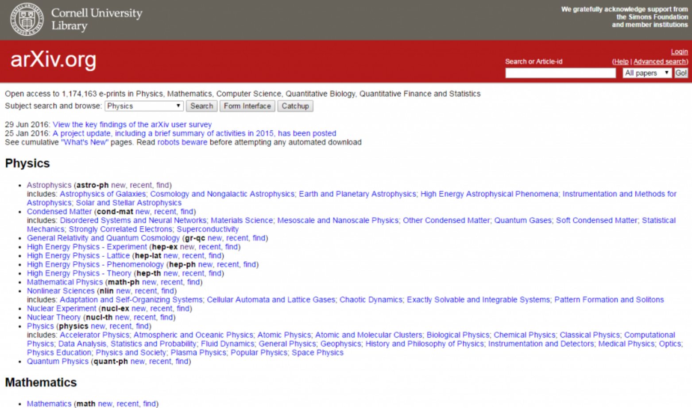
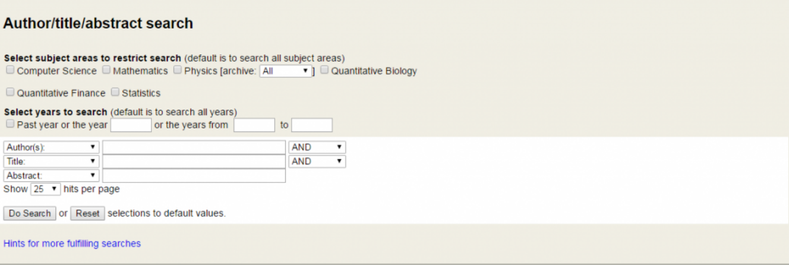
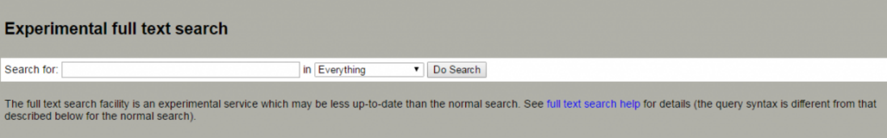

# 線上預印本資料庫 簡介 arXiv.org

[Posted on 2016 年 8 ⽉月 26 ⽇日 by](http://tul.blog.ntu.edu.tw/archives/17366) [NTU Library](http://tul.blog.ntu.edu.tw/archives/author/tul)

１

[arXiv.org 是⼀一個線上預印本資料庫（圖1），現由美國康乃爾⼤大學arXiv團隊維護，提供](https://arxiv.org/)
全球使⽤用者免費搜尋及下載文章，⽬目前收藏的論文篇數已超過⼀一百萬篇，也是國內許多研
究⼈人員愛⽤用的資料庫之⼀一，臺灣⼤大學(以下簡稱本校)2015年的使⽤用率更是排名全球第69
位，也因此本校於今(2016)年正式加入成為arXiv.org會員之⼀一，以下將簡單的整理介紹
arXiv.org的緣起和服務，以及arXiv未來服務擴充的可能⽅方向。

圖1：arXiv.org⾸首⾴頁(https://arxiv.org)

⼀一、arXiv.org簡介

arXiv.org線上預印本資料庫，原名LANL預印本資料庫(xxx.lanl.gov)，於1991年由⾦金斯帕
(Paul Ginsparg)博⼠士所開發(圖2)，⾦金斯帕博⼠士為理論物理學家，重要研究成果包含與威
爾森(Kenneth G Wilson)合作⽽而知名的Ginsparg-Wilson fermion 。⾦金斯帕⼀一開始開發 ２
arXiv.org主要是為收錄⾼高能物理學領域的預印本，使原本不易取得的預印本得以廣⼤大流
通。後來由於獲得廣⼤大的接受，於是逐漸擴⼤大到物理學其它領域，⽬目前收錄的文章亦包含
數學、計算科學、計量⽣生物、計量⾦金融、統計等領域，Nature雜誌並在2011年適逢其滿

３

20
周年時特別以專文報導，可⾒見其在學術領域的重要性。

２

３

圖2：ArXiv開發者Paul Ginsparg博⼠士

由於預印本沒有審查機制，且透過公開預印本可以提早宣告⾃自⼰己的研究成果，並可以在
接受期刊審查前取得同儕的評論意⾒見做為改善的⽅方向，所以⽬目前許多領域研究者在投稿前
都會先將文章上傳⾄至arXiv.org，過去20多年的重要論文幾乎都可以在arXiv.org上找得到。
除前述期刊文章外，arXiv.org也收藏許多研討會會議論文、專題介紹文章或講義，例如
SLAC eConf資料庫所收錄各研討會論文、 4 TASI  Summer School 5 的課程講義等，許多都
可在arXiv.org上取得。因此⼤大⼤大的提升研究成果及知識的交流，甚⾄至改變了傳統研究成果
傳播模式，例如俄羅斯數學家帕瑞爾曼(Grigori Perelman)只把他證明的龐卡赫猜想
(Poincaré conjecture)文章公開於 6 arXiv.org，⽽而沒有投⾄至正式期刊。

4 5

6

⼆二、arXiv.org服務

arXiv.org資料庫提供許多整合應⽤用服務，以下簡單介紹常⽤用的瀏覽(含文章下載)、檢索、
及資料庫串聯整合等服務。

⾸首先，在瀏覽⽅方⾯面，arXiv.org在⾸首⾴頁即依學科分類，並提供各學科領域當⽇日(new)或最近
⼀一周(recent)的文章連結，讓使⽤用者可快速取得相關領域最新研究成果。各文章並提供預
印本全文下載，及正式出版期刊DOI連結。另外arXiv.org並與 [INSPIRE(⾼高能物理文獻資](https://inspirehep.net/)
料庫) 及 7 [ADS(天體物理學資料庫) 合作，進⼀一步提供文章的參考書⽬目連結及被引⽤用連結，](http://adswww.harvard.edu/) 8
⼤大⼤大增進使⽤用者查詢相關文章的便利性。

在檢索⽅方⾯面，arXiv.org提供了相當簡潔且⽅方便的查詢介⾯面，主要有下列三種查詢⽅方式：

(⼀一)簡要檢索：提供使⽤用者透過文章的文獻識別碼直接查詢文章。

圖3：arXiv.org簡要檢索介⾯面

(⼆二)進階檢索：提供使⽤用者透過輸入或組合作者、篇名，或摘要等關鍵字查詢文章。

圖4：arXiv.org進階檢索介⾯面

(三)全文檢索：提供使⽤用者以關鍵字查詢全文。

圖5：arXiv.org全文檢索介⾯面

透過上述三種⽅方式，⽅方便使⽤用者可依需求及資訊，快速查詢所需要的文章。

在資料庫串連整合⽅方⾯面，arXiv.org除與INSPIRE及ADS等資料庫串聯以提供文章找文章服

、
務外，亦可讓作者將著作資料下載⾄至所屬機構的典藏系統，及提供OAI-PMH API及RSS
等整批詮釋資料下載服務，讓資料的應⽤用更為彈性及⽅方便，例如在 9 Google檢索查詢學術
文章，許多全文下載連結其實是直接串聯⾄至arXiv.org資料庫。另外，arXiv.org也提供作者
[將⾃自⼰己在arXiv.org的作者帳號與其ORCID](http://orcid.org/) 10 帳號串聯，讓作者在arXiv.org的著作可以正確
串連到其在其他資料庫的資料，進⼀一步幫助解決了研究者間姓名重複問題。

9

10

